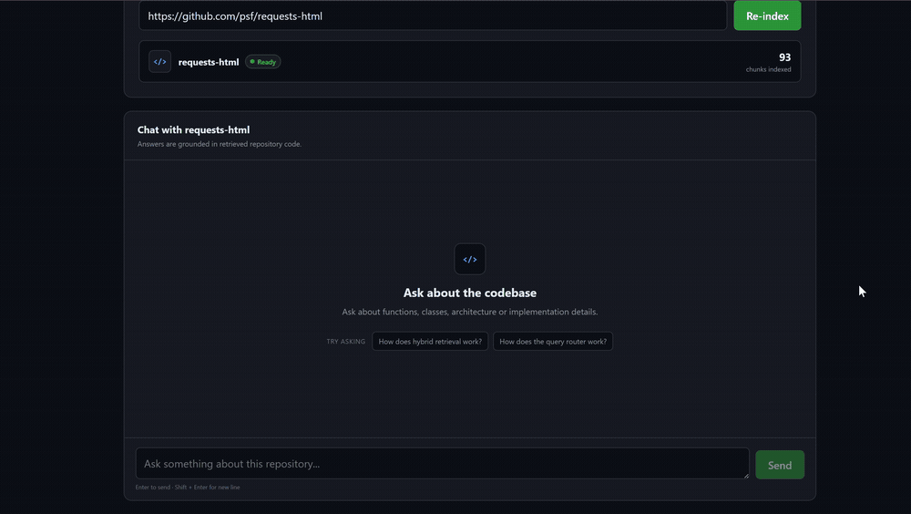
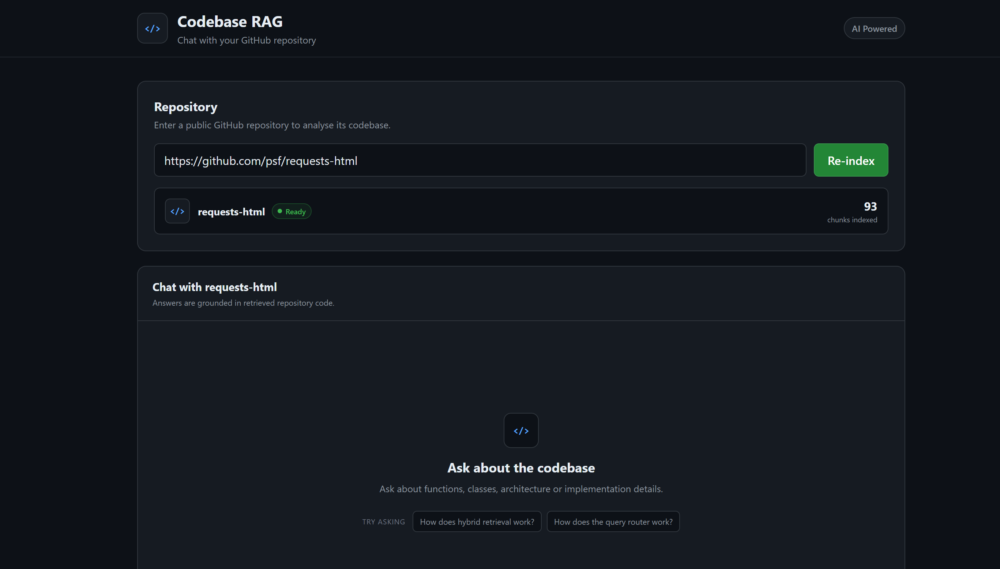

# Codebase RAG

> Repository-aware RAG system for code understanding using AST-based chunking, hybrid retrieval, and grounded LLM responses.

Codebase RAG is a full-stack repository-aware question answering system that allows developers to ingest a public GitHub repository and ask natural-language questions about its implementation.

Instead of treating source code as plain text, the system parses Python code using AST-based structural chunking, generates Gemini embeddings, combines dense FAISS retrieval with sparse BM25 retrieval using Weighted Reciprocal Rank Fusion (RRF) and CrossEncoder reranking, and generates grounded answers with file, symbol, and line-level citations.

The application includes a FastAPI backend and a React + Vite frontend, deployed using Render and Vercel.

---

## 🚀 Live Demo

**Try it here:** https://codebase-rag-khaki.vercel.app

Paste the URL of a public GitHub repository, index it, and start asking questions about its implementation.

> The backend is hosted on Render's free tier and may take a short time to wake up after a period of inactivity.

### Demo



---

## ✨ Features

- Ingest public GitHub repositories
- Clone or update previously ingested repositories
- Parse Python source code using AST
- Chunk code by functions, classes, methods, and structural units
- Preserve symbol metadata and exact source line numbers
- Generate semantic embeddings using Gemini
- Dense semantic retrieval using FAISS
- Sparse lexical retrieval using BM25
- Hybrid retrieval using Weighted Reciprocal Rank Fusion (RRF)
- CrossEncoder reranking of fused candidates
- Retrieval evaluation suite (Recall@k, MRR, nDCG benchmarking)
- Symbol-aware query routing
- Exact and qualified symbol lookup
- Grounded Gemini answer generation
- Multi-chunk code reasoning
- File, symbol, type, and line-level source citations
- Reject questions unsupported by repository context
- Refresh retrieval indexes after re-indexing
- Restore the active repository across frontend refreshes
- Interactive React chat interface
- Production deployment using Vercel and Render

---

## 🧠 How It Works

```text
                         GitHub Repository
                                │
                                ▼
                       Repository Ingestion
                                │
                                ▼
                          Clone / Update
                                │
                                ▼
                            AST Parser
                                │
                                ▼
                  Functions / Classes / Methods
                                │
                                ▼
                         Structural Chunks
                                │
                 ┌──────────────┴──────────────┐
                 │                             │
                 ▼                             ▼
         Gemini Embeddings                Tokenisation
                 │                             │
                 ▼                             ▼
               FAISS                          BM25
           Dense Retrieval               Sparse Retrieval
                 │                             │
                 └──────────────┬──────────────┘
                                │
                                ▼
                Weighted Reciprocal Rank Fusion
                                │
                                ▼
                       CrossEncoder Reranker
                                │
                                ▼
                           Query Router
                       ┌────────┴────────┐
                       │                 │
                       ▼                 ▼
                 Symbol Lookup      Hybrid Retrieval
                       │                 │
                       └────────┬────────┘
                                │
                                ▼
                       Retrieved Context
                                │
                                ▼
                             Gemini
                                │
                                ▼
                  Grounded Answer + Sources
```

---

## 📥 Repository Ingestion

The user provides the URL of a public GitHub repository.

The FastAPI backend clones the repository locally. If the repository has already been cloned, the existing copy can be updated instead.

The repository is then passed through the complete indexing pipeline:

```text
GitHub Repository
       │
       ▼
Clone / Update
       │
       ▼
AST Parsing
       │
       ▼
Structural Chunking
       │
       ▼
Gemini Embeddings
       │
       ├─────────────► FAISS
       │
       └─────────────► BM25
```

When indexing completes, the active retrieval stores are refreshed so subsequent queries use the newly indexed repository.



---

## 🌳 AST-Based Code Parsing

Python files are parsed using Python's Abstract Syntax Tree (`ast`) module.

Instead of splitting source code at arbitrary character or token boundaries, the parser extracts meaningful programming structures such as:

- functions
- async functions
- classes
- methods
- imports
- docstrings
- assignments

Methods are stored using qualified names such as:

```text
APIRouter.include_router
FastAPI.openapi
GenerationService.generate
HTML.render
```

This creates retrieval units aligned with actual program structure rather than arbitrary text windows.

---

## 🧩 Structural Code Chunking

Parsed structures are converted into independently searchable chunks.

Each chunk contains its source code along with metadata:

```text
file
type
name
start_line
end_line
```

For example:

```text
Type: method
Name: HTML.render
File: requests_html.py
Lines: 603-677
```

This metadata is preserved throughout retrieval and later used to generate source citations.

---

## 🔢 Gemini Embeddings

Each structural code chunk is converted into a dense vector representation using the Gemini embedding API.

Embeddings are generated in batches during repository indexing.

The resulting vectors capture semantic information about the code, allowing conceptual queries to retrieve relevant implementations even when the wording differs from identifiers used in the repository.

For example:

```text
How does this project render JavaScript?
```

can retrieve:

```text
HTML.render
HTML._async_render
HTML.arender
```

without requiring the query to explicitly mention all three symbols.

---

# 🔎 Retrieval System

Codebase RAG combines four retrieval components:

1. Dense semantic retrieval
2. Sparse lexical retrieval
3. Weighted RRF fusion + CrossEncoder reranking
4. Direct symbol lookup

---

## Dense Retrieval — FAISS

Gemini embeddings for code chunks are stored in a FAISS vector index.

Vectors are L2-normalised, allowing inner-product search to behave like cosine similarity.

At query time:

```text
Question
   │
   ▼
Gemini Embedding
   │
   ▼
FAISS Similarity Search
   │
   ▼
Semantic Candidates
```

Dense retrieval is particularly useful for conceptual questions where the user's wording differs from the implementation.

For example:

```text
How does the application combine search results?
```

can retrieve `hybrid_search` even if the query does not use that exact function name.

---

## Sparse Retrieval — BM25

BM25 performs lexical retrieval based on token overlap between the query and indexed code.

The BM25 representation includes information such as:

- symbol name
- symbol type
- filename
- source code

This makes sparse retrieval particularly useful for programming identifiers such as:

```text
BaseParser
include_router
GenerationService
HTML.render
```

BM25 complements dense retrieval by preserving strong lexical matches.

---

## 🔀 Hybrid Retrieval

Conceptual queries are searched using both FAISS and BM25.

```text
                    Query
                      │
             ┌────────┴────────┐
             │                 │
             ▼                 ▼
           FAISS              BM25
      Semantic Search     Lexical Search
             │                 │
             ▼                 ▼
       Dense Candidates   Sparse Candidates
             │                 │
             └────────┬────────┘
                      │
                      ▼
          Weighted Reciprocal Rank Fusion
                      │
                      ▼
              CrossEncoder Reranker
                      │
                      ▼
                 Final Ranking
```

A larger candidate pool is retrieved from both systems before fusion.

The fused candidates are then reranked by a CrossEncoder cross-attention model, which jointly scores each (query, chunk) pair for finer-grained relevance ordering than fusion alone can provide.

Test-file results are slightly penalised during fusion so implementation code is preferred when relevance is otherwise similar.

---

## 🏆 Weighted Reciprocal Rank Fusion

FAISS and BM25 produce fundamentally different scores.

A FAISS similarity score cannot be meaningfully compared directly with a BM25 relevance score.

Instead of combining raw scores, Codebase RAG uses **Weighted Reciprocal Rank Fusion (RRF)**, giving greater importance to dense retrieval while preserving strong lexical matches from BM25.

For a result appearing at rank `r`:

```text
RRF score = weight / (k + r)
```

Results appearing near the top of multiple retrieval systems accumulate larger combined scores.

Example:

```text
                 FAISS Ranking      BM25 Ranking
                       │                 │
                       ▼                 ▼
hybrid_search          #1                #2
retrieve               #3                #1
BM25Store              #5                #3
                       │                 │
                       └────────┬────────┘
                                ▼
                        Weighted RRF
                                │
                                ▼
                         Combined Ranking
```

This allows heterogeneous retrieval systems to be combined without requiring score normalisation.

---

## 🥇 CrossEncoder Reranking

RRF combines *rankings*, but it does not directly evaluate how relevant a chunk actually is to the query text.

After fusion, the top candidates are re-scored using a CrossEncoder (`ms-marco-MiniLM-L-6-v2`), which encodes the query and each candidate chunk jointly rather than independently. This lets the reranker capture finer relevance signals that pure vector or lexical similarity can miss, at the cost of extra compute per query — so it's applied only to the fused shortlist rather than the full candidate pool.

In evaluation, this improved MRR and nDCG@5 over Weighted RRF alone (see [Retrieval Evaluation](#-retrieval-evaluation) below).

---

## 🎯 Symbol-Aware Query Routing

Not every code question should use the same retrieval strategy.

Consider:

```text
HTML.render
```

versus:

```text
How does this project render JavaScript?
```

The first is a precise structural reference.

The second is a conceptual question requiring broader retrieval.

The query router therefore distinguishes between exact/qualified symbol queries and conceptual queries.

```text
                         User Query
                             │
                             ▼
                     Detect Known Symbol
                             │
                  ┌──────────┴──────────┐
                  │                     │
            Exact / Qualified       Conceptual
                Symbol                Query
                  │                     │
                  ▼                     ▼
            Symbol Lookup        Hybrid Retrieval
                  │                     │
                  └──────────┬──────────┘
                             │
                             ▼
                       Final Context
```

Queries such as:

```text
BaseParser
```

and:

```text
HTML.render
```

can therefore prioritise direct symbol retrieval.

Conceptual questions continue through the hybrid retrieval pipeline.


---

## 🧠 Multi-Chunk Reasoning

Many implementation questions cannot be answered from a single function.

For example:

```text
How does this project render JavaScript?
```

may require understanding:

```text
HTML.render
      │
      ▼
HTML._async_render
      │
      ├── creates browser page
      ├── loads content
      ├── executes JavaScript
      └── retrieves rendered HTML

HTML.arender
      │
      ▼
asynchronous rendering interface
```

Hybrid retrieval can retrieve these related chunks independently.

The generation layer then synthesises the retrieved implementations into a coherent explanation while citing the source chunks actually used.


---

## 🔒 Grounded Answer Generation

Retrieved chunks are passed to Gemini as repository context.

The generation layer explicitly instructs the model to answer using **only the supplied repository information**.

The model returns structured output:

```json
{
  "answerable": true,
  "answer": "Generated answer...",
  "used_sources": [1, 2]
}
```

The backend validates this response and maps `used_sources` back to retrieved chunks.

Only sources actually selected by the model are returned to the frontend.

If repository context is insufficient:

```json
{
  "answerable": false,
  "answer": "I couldn't find enough information in the repository.",
  "used_sources": []
}
```

This prevents the system from intentionally falling back to the model's general programming knowledge when repository evidence is unavailable.

---

## 📚 Source Citations

Generated answers include the source locations used to support them.

Example:

```text
HTML._async_render
requests_html.py
async_method
Lines 505-547
```

Each source contains:

- source number
- filename
- symbol name
- symbol type
- start line
- end line

This makes generated explanations traceable back to the actual repository implementation.

---

# 📊 Retrieval Evaluation

The retrieval pipeline was evaluated on manually curated benchmarks across two public repositories, spanning symbol lookup and conceptual retrieval query types.

## Repositories Evaluated

| Repository      | Chunks | Queries | Status     |
| --------------- | -----: | ------: | ---------- |
| `requests-html` |     93 |      20 | ✅ Complete |
| `requests`      |    707 |      20 | ✅ Complete |

## Metrics

- Recall@3
- Recall@5
- Mean Reciprocal Rank (MRR)
- nDCG@5

## Retrieval Configurations Compared

- BM25 (sparse lexical)
- Dense (Gemini embeddings + FAISS)
- Hybrid (Weighted RRF)
- Hybrid + CrossEncoder Reranker

### `requests-html` results (20 queries: symbol lookup + conceptual)

| Retriever  | Recall@3 | Recall@5 |   MRR | nDCG@5 |
| ---------- | -------: | -------: | ----: | -----: |
| BM25       |     0.70 |     0.80 | 0.614 |  0.661 |
| Dense      |     0.90 | **1.00** | 0.681 |  0.762 |
| **Hybrid** | **0.90** |     0.95 | **0.838** | **0.866** |

Hybrid retrieval produced the strongest overall ranking quality on this repository.

### `requests` results (20 queries: 10 symbol lookup, 10 conceptual)

| Retriever              | Recall@3 | Recall@5 |   MRR | nDCG@5 |
| ---------------------- | -------: | -------: | ----: | -----: |
| BM25                   |     0.50 |     0.60 | 0.439 |  0.479 |
| Dense                  |     0.85 |     0.90 | 0.713 |  0.761 |
| Hybrid (Weighted RRF)  | **0.90** | **0.95** | 0.713 |  0.773 |
| Hybrid + CrossEncoder  |     0.85 |     0.85 | **0.767** | **0.788** |

On this larger, noisier repository, plain fusion alone was not enough to beat Dense on MRR — but adding the CrossEncoder reranker on top of Weighted RRF pushed both MRR and nDCG@5 past all other configurations, confirming that reranking recovers the ordering quality that pure rank fusion misses at scale.

## Overall Evaluation Suite

- **2 repositories**
- **40 evaluation queries**
- **4 retrieval configurations**
- **4 retrieval metrics**

This gives **160 retrieval runs** (40 queries × 4 configurations) and **640 metric values** (160 runs × 4 metrics).

## Remaining Evaluation Work

- Latency measurements (average, p50, p95 response time)
- Expanded evaluation to additional repositories
- Published `EVALUATION.md` with full methodology

---

# 🛠️ Tech Stack

## Backend

- Python
- FastAPI
- Uvicorn
- GitPython
- Python AST
- NumPy
- FAISS (`faiss-cpu`)
- BM25 (`rank-bm25`)
- Gemini API (`google-genai`)
- `python-dotenv`

## Retrieval

- Gemini Embeddings
- FAISS (Dense Retrieval)
- BM25 (Sparse Retrieval)
- Weighted Reciprocal Rank Fusion
- CrossEncoder (`ms-marco-MiniLM-L-6-v2`)
- Retrieval Evaluation (Recall@k, MRR, nDCG)
- Symbol-aware query routing
- Direct symbol lookup

## Generation

- Gemini
- Structured JSON generation
- Retrieved-context grounding
- Source validation

## Frontend

- React
- Vite
- JavaScript
- CSS

## Deployment

- **Vercel** — React/Vite frontend
- **Render** — FastAPI backend
- **GitHub** — source repositories
- **Gemini API** — embeddings and answer generation

---

# 📁 Project Structure

```text
codebase-rag/
│
├── app/
│   ├── api/
│   │   ├── ask.py
│   │   └── ingest.py
│   │
│   ├── services/
│   │   ├── ast_parser.py
│   │   ├── bm25_store.py
│   │   ├── chunking_service.py
│   │   ├── embedding_service.py
│   │   ├── generation_service.py
│   │   ├── git_service.py
│   │   ├── hybrid_retrieval.py
│   │   ├── indexing_service.py
│   │   ├── llm_service.py
│   │   ├── query_router.py
│   │   ├── retrieval_service.py
│   │   ├── symbol_retrieval.py
│   │   └── vector_store.py
│   │
│   └── main.py
│
├── frontend/
│   ├── src/
│   │   ├── App.jsx
│   │   ├── App.css
│   │   └── main.jsx
│   │
│   └── package.json
│
├── docs/
│   ├── demo.gif
│   └── screenshots/
│       ├── repository.png
│       ├── multi-chunk-answer.png
│       └── symbol-lookup.png
│
├── repositories/
├── vector_store/
├── bm25_store/
│
├── requirements.txt
└── README.md
```

---

# 🔌 API

## `POST /ingest`

Clones and indexes a public GitHub repository.

Example request:

```json
{
  "repo_url": "https://github.com/psf/requests-html"
}
```

The ingestion pipeline performs:

```text
GitHub
  │
  ▼
Clone / Update
  │
  ▼
AST Parsing
  │
  ▼
Structural Chunking
  │
  ▼
Gemini Embeddings
  │
  ├────► FAISS
  │
  └────► BM25
  │
  ▼
Refresh Retrieval State
  │
  ▼
Ready
```

---

## `POST /ask`

Asks a question about the currently indexed repository.

Example request:

```json
{
  "question": "How does hybrid retrieval combine BM25 and FAISS?"
}
```

Example response:

```json
{
  "answer": "Hybrid retrieval fetches candidates from both dense FAISS search and sparse BM25 search before combining their rankings using Weighted Reciprocal Rank Fusion and CrossEncoder reranking.",
  "sources": [
    {
      "id": 1,
      "file": "app/services/hybrid_retrieval.py",
      "type": "function",
      "name": "hybrid_search",
      "start_line": 54,
      "end_line": 72
    }
  ]
}
```

---

## `GET /repository`

Returns information about the currently active repository.

The frontend uses this endpoint to restore repository information after a browser refresh.

---

# 💻 Running Locally

## 1. Clone the Repository

```bash
git clone https://github.com/shreyagupta1181/codebase-rag.git
cd codebase-rag
```

## 2. Create a Virtual Environment

### Windows

```bash
python -m venv .venv
.venv\Scripts\activate
```

### macOS / Linux

```bash
python3 -m venv .venv
source .venv/bin/activate
```

## 3. Install Backend Dependencies

```bash
pip install -r requirements.txt
```

## 4. Configure Gemini

Create a `.env` file in the project root:

```env
GEMINI_API_KEY=your_gemini_api_key
```

Never commit `.env` or API keys to Git.

## 5. Start the Backend

```bash
uvicorn app.main:app --reload
```

The API runs at:

```text
http://127.0.0.1:8000
```

FastAPI documentation is available at:

```text
http://127.0.0.1:8000/docs
```

---

## 6. Configure the Frontend

Open another terminal:

```bash
cd frontend
npm install
```

Create:

```text
frontend/.env
```

with:

```env
VITE_API_URL=http://127.0.0.1:8000
```

## 7. Start the Frontend

```bash
npm run dev
```

The frontend normally runs at:

```text
http://localhost:5173
```

---

# ☁️ Deployment

## Frontend — Vercel

The React/Vite frontend is deployed on Vercel:

`https://codebase-rag-khaki.vercel.app`

Production configuration:

```env
VITE_API_URL=https://codebase-rag-ydwf.onrender.com
```

The frontend sends ingestion and question requests to the deployed FastAPI API.

---

## Backend — Render

The FastAPI backend is deployed on Render:

`https://codebase-rag-ydwf.onrender.com`

API documentation:

`https://codebase-rag-ydwf.onrender.com/docs`

The Vercel frontend communicates with the backend using:

```env
VITE_API_URL=https://codebase-rag-ydwf.onrender.com
```

The backend requires:

```env
GEMINI_API_KEY=your_gemini_api_key
```

The Gemini API key is configured securely as an environment variable and is never committed to the repository.

Production start command:

```bash
uvicorn app.main:app --host 0.0.0.0 --port $PORT
```

FastAPI CORS configuration allows requests from the deployed Vercel frontend.

> The free Render instance can spin down after inactivity, so the first request after an idle period may take longer than subsequent requests.

---

# 💡 Design Decisions

## Why AST Instead of Fixed-Size Chunking?

Source code has meaningful structural boundaries.

A function or method represents a coherent unit of behaviour, while fixed-size text chunking can split implementation logic across unrelated chunks.

```text
Fixed-size chunking:

function start
    ...
---------------- chunk boundary
    ...
function end


AST chunking:

┌───────────────────────────┐
│ Complete function/method  │
└───────────────────────────┘
```

AST parsing allows chunks to correspond to actual programming constructs while naturally preserving symbol names and line ranges.

---

## Why Gemini Embeddings?

Conceptual questions often do not contain the exact identifiers used in source code.

Dense embeddings allow semantically related queries and implementations to match even when their wording differs.

Embedding generation is performed in batches during indexing to reduce API requests.

---

## Why Both BM25 and FAISS?

Code search is both lexical and semantic.

Consider:

```text
HTML.render
```

The exact identifier is highly informative, making lexical matching valuable.

But:

```text
How does this project execute JavaScript in a browser?
```

requires semantic retrieval even if those exact words do not appear in the implementation.

Combining FAISS and BM25 provides both behaviours.

---

## Why Weighted Reciprocal Rank Fusion?

BM25 and FAISS use different scoring systems.

Directly combining their raw scores would require score calibration or normalisation.

RRF instead operates on ranking positions:

```text
score = weight / (k + rank)
```

Weighting the fusion toward dense retrieval, while still preserving BM25's exact-match strength, gave better empirical results than unweighted RRF during evaluation.

---

## Why Add a CrossEncoder Reranker?

Rank fusion alone combines *positions*, not a direct relevance judgment of the query against each candidate's actual text.

Evaluation showed that on a larger, noisier repository, Weighted RRF's ranking advantage over Dense retrieval narrowed. Reranking the fused shortlist with a CrossEncoder recovered and exceeded that advantage on MRR and nDCG@5, at an acceptable extra cost since it's only applied to a small shortlist rather than the full candidate set.

---

## Why Symbol-Aware Routing?

Pure semantic retrieval is not always appropriate for exact code identifiers.

If the user asks:

```text
HTML.render
```

the system already has a strong indication of the implementation being requested.

Direct symbol lookup provides deterministic structural retrieval for these cases, while hybrid retrieval remains available for broader conceptual questions.

---

## Why Grounded Generation?

A general-purpose LLM may already know about popular libraries.

That is undesirable for repository analysis if the goal is to explain the code that was actually indexed.

Codebase RAG therefore supplies retrieved repository chunks as context and instructs Gemini to answer only from that evidence.

If the retrieved context cannot support an answer, the system returns an insufficient-context response rather than intentionally relying on outside model knowledge.

---

# ⚠️ Current Limitations

### Single Active Repository

The current deployment maintains one active retrieval index at a time.

Indexing another repository replaces the active FAISS and BM25 indexes.

A future version could maintain separate persistent indexes for multiple repositories.

### Python-Focused Structural Parsing

AST-based structural parsing currently focuses on Python source code.

Supporting languages such as JavaScript, TypeScript, Java, C++, Go, and Rust would require language-specific parsers or a framework such as Tree-sitter.

### Inherited Symbol Resolution

Symbols are indexed according to the class where they are defined.

Inherited methods are not currently resolved through class hierarchies during direct symbol lookup.

A future implementation could construct a symbol graph representing inheritance and other code relationships.

### Retrieval Quality

Hybrid retrieval with reranking improves robustness but does not guarantee perfect ranking.

Large repositories containing extensive tests, generated code, repeated identifiers, or complex inheritance structures can introduce retrieval noise.

### Deployment Constraints

Repository cloning, parsing, embedding generation, and index construction happen during ingestion.

Large repositories can therefore require more processing time and Gemini embedding API usage.

The deployed backend may also experience cold-start latency after inactivity.

---

# 🔮 Future Improvements

- Latency benchmarking (p50/p95 query response time)
- Larger CrossEncoder rerankers
- Multi-vector retrieval
- Retrieval caching
- Learning-to-rank
- Multi-repository persistent indexes
- Inheritance-aware symbol resolution
- Support for additional programming languages
- Tree-sitter based parsing
- Function call graphs
- Code dependency graphs
- Incremental indexing of changed files
- Conversation history
- GitHub authentication for private repositories
- Clickable GitHub source links
- Streaming responses
- Background indexing jobs
- Repository-level metadata filters
- Index caching

---

# 📌 Project Status

**Core system complete and deployed.**

Implemented:

- GitHub repository ingestion
- Repository cloning and updating
- AST-based Python parsing
- Structural code chunking
- Gemini batch embeddings
- FAISS dense retrieval
- BM25 sparse retrieval
- Weighted Reciprocal Rank Fusion
- CrossEncoder reranking
- Retrieval evaluation framework (Recall@k, MRR, nDCG benchmarking across 2 repos, 40 queries, 4 configurations)
- Symbol-aware query routing
- Exact symbol lookup
- Multi-chunk retrieval
- Grounded Gemini generation
- Structured model output validation
- File, symbol, and line-level citations
- Unsupported-query rejection
- Repository re-indexing
- Retrieval store refreshing
- React/Vite frontend
- FastAPI backend
- Vercel frontend deployment
- Render backend deployment

The deployed application has been tested with third-party codebases for conceptual retrieval, exact symbol queries, multi-chunk synthesis, negative grounding, and repository switching.

---

## 👩‍💻 Author

**Shreya Gupta**

GitHub: `shreyagupta1181`